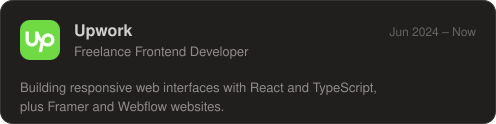
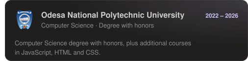
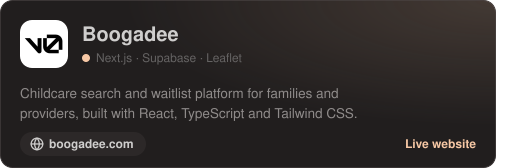
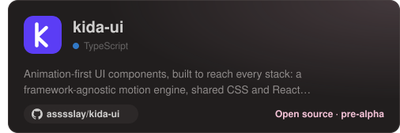
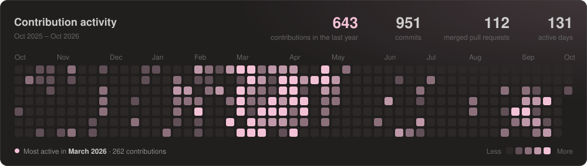

<h1 align="center"><b>Frontend TypeScript Developer</b></h1>

Ruslana Avramova · from Ukraine 🇺🇦 · 3+ years of experience

---

## Experience

## Tech Stack

<b>All skills</b>

 

**Languages**

**Frameworks**

**Styling & UI**

**Libraries & tools**

**Backend & databases**

**Design & no-code**

**Deployment**

**Development tools**

---

## Projects

## Contributed to

---

## GitHub Activity

<b>About me</b>

 

Hi, I'm Ruslana! 👩🏻‍💻 I'm a frontend developer with a Computer Science degree with honors
and over three years of experience building modern web interfaces.

- Currently working with **React and TypeScript**
- Creating responsive websites in **Framer and Webflow**
- Interested in polished interfaces, animations and product design
- Open to freelance projects and collaborations

**Languages:** English (fluent) · Ukrainian and Russian (native)

