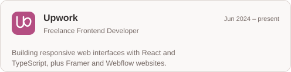
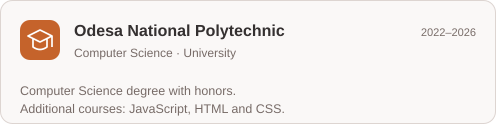
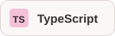
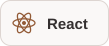
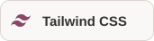
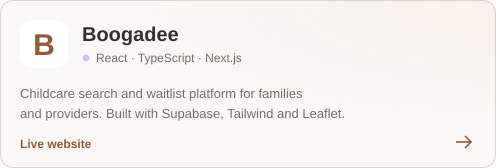
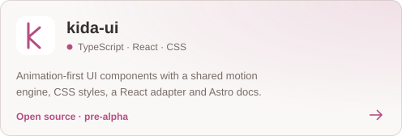

<h1 align="center">Frontend TypeScript Developer</h1>

  Ruslana Avramova · from Ukraine 🇺🇦 · 3+ years of experience

Creating responsive, interactive and carefully polished web experiences.

  <a href="mailto:avramova.ruslana.a.r.r@gmail.com"><picture><source media="(prefers-color-scheme: dark)" srcset="./assets/profile/button-email-dark.svg" /></picture></a>
  <a href="https://ruslana-portfolio.vercel.app/"><picture><source media="(prefers-color-scheme: dark)" srcset="./assets/profile/button-portfolio-dark.svg" /></picture></a>
  <a href="https://www.upwork.com/freelancers/~01c286c87cffa25dbf"><picture><source media="(prefers-color-scheme: dark)" srcset="./assets/profile/button-upwork-dark.svg" /></picture></a>
  <a href="https://t.me/asssslay"><picture><source media="(prefers-color-scheme: dark)" srcset="./assets/profile/button-telegram-dark.svg" /></picture></a>

---

## Experience

  <a href="https://www.upwork.com/freelancers/~01c286c87cffa25dbf"><picture><source media="(prefers-color-scheme: dark) and (max-width: 600px)" srcset="./assets/profile/experience-upwork-mobile-dark.svg" /><source media="(max-width: 600px)" srcset="./assets/profile/experience-upwork-mobile-light.svg" /><source media="(prefers-color-scheme: dark)" srcset="./assets/profile/experience-upwork-dark.svg" /></picture></a>
  <picture><source media="(prefers-color-scheme: dark) and (max-width: 600px)" srcset="./assets/profile/experience-education-mobile-dark.svg" /><source media="(max-width: 600px)" srcset="./assets/profile/experience-education-mobile-light.svg" /><source media="(prefers-color-scheme: dark)" srcset="./assets/profile/experience-education-dark.svg" /></picture>

## Tech Stack

  <picture><source media="(prefers-color-scheme: dark)" srcset="./assets/profile/tool-typescript-dark.svg" /></picture>
  <picture><source media="(prefers-color-scheme: dark)" srcset="./assets/profile/tool-react-dark.svg" /></picture>
  <picture><source media="(prefers-color-scheme: dark)" srcset="./assets/profile/tool-tanstack-dark.svg" /></picture>
  <picture><source media="(prefers-color-scheme: dark)" srcset="./assets/profile/tool-tailwind-css-dark.svg" /></picture>
  <picture><source media="(prefers-color-scheme: dark)" srcset="./assets/profile/tool-framer-dark.svg" /></picture>
  <picture><source media="(prefers-color-scheme: dark)" srcset="./assets/profile/tool-webflow-dark.svg" /></picture>

<b>All skills</b>

- **Languages:** JavaScript · TypeScript · HTML · CSS
- **Frameworks:** React · Next.js · HonoJS
- **Styling &amp; UI:** Tailwind CSS · shadcn/ui · PostCSS · Bootstrap · Sass / SCSS · Less
- **Libraries &amp; tools:** TanStack Router · Vite · Framer Motion · Zod · Parcel · GSAP
- **Backend &amp; databases:** Supabase · Convex · PostgreSQL · Drizzle ORM
- **Design &amp; no-code:** Framer · Webflow · Figma
- **Deployment:** Vercel · Netlify · Render
- **Development tools:** Git · VS Code · Codex · ChatGPT · Claude

---

## Projects

  <a href="https://boogadee.com/"><picture><source media="(prefers-color-scheme: dark) and (max-width: 600px)" srcset="./assets/profile/project-boogadee-mobile-dark.svg" /><source media="(max-width: 600px)" srcset="./assets/profile/project-boogadee-mobile-light.svg" /><source media="(prefers-color-scheme: dark)" srcset="./assets/profile/project-boogadee-dark.svg" /></picture></a>
  <a href="https://github.com/asssslay/kida-ui"><picture><source media="(prefers-color-scheme: dark) and (max-width: 600px)" srcset="./assets/profile/project-kida-mobile-dark.svg" /><source media="(max-width: 600px)" srcset="./assets/profile/project-kida-mobile-light.svg" /><source media="(prefers-color-scheme: dark)" srcset="./assets/profile/project-kida-dark.svg" /></picture></a>

<b>Project details</b>

### Boogadee

Childcare search and waitlist platform for families and providers.

`React` `TypeScript` `Next.js` `Supabase` `Tailwind CSS` `Leaflet`

[Live website →](https://boogadee.com/)

### kida-ui

Animation-first UI components, built to reach every stack. A framework-agnostic
motion engine and shared CSS styles, with React components and an Astro documentation site.

**Currently in pre-alpha.** Packages are not published yet.

`TypeScript` `React` `CSS` `Animation` `Astro`

[Explore the repository →](https://github.com/asssslay/kida-ui)

<b>About me</b>

Hi, I'm Ruslana! 👩🏻‍💻 I’m a frontend developer with a Computer Science degree with honors
and over three years of experience building modern web interfaces.

- Currently working with **React and TypeScript**
- Creating responsive websites in **Framer and Webflow**
- Interested in polished interfaces, animations and product design
- Open to freelance projects and collaborations

**Languages:** English (fluent) · Ukrainian and Russian (native)

---

Feel free to <a href="mailto:avramova.ruslana.a.r.r@gmail.com">contact me any time</a>! 💌

